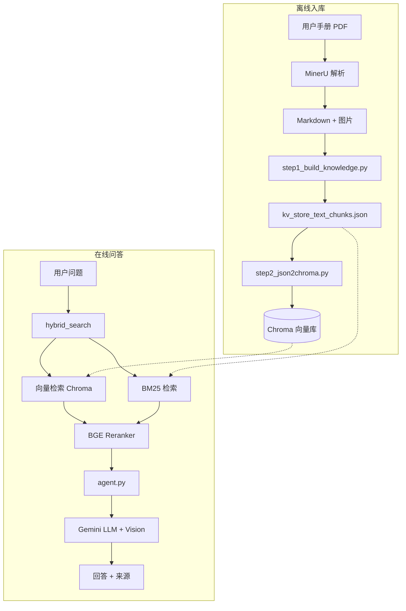

# RAG 流水线详细文档

本文档描述科陆用户手册 RAG 系统的检索增强生成全流程：从 PDF 解析、语义切分、向量入库，到在线混合检索与 LLM 生成。

---

## 1. 整体架构



### 设计原则

1. **离线重、在线轻**：PDF 解析与 Embedding 批量写入在入库阶段完成；问答时仅做 query embedding + 检索 + 一次 LLM 调用。
2. **混合检索优于单向量**：手册中存在大量专业术语、型号、步骤编号，纯向量检索容易漏召；BM25 与向量互补。
3. **重排提升精度**：先用较宽的候选集召回，再用 Cross-Encoder 对 query-passage 精排。
4. **Embedding 一致性**：入库与查询必须使用同一 Embedding 后端和模型，向量才可比较。

---

## 2. 数据资产

### 2.1 目录与文件

| 路径 | 说明 |
|------|------|
| `用户手册/*.pdf` | 原始 PDF（11 份产品手册） |
| `rag_output_manuals/<md_stem>/auto/*.md` | MinerU 输出的 Markdown |
| `rag_output_manuals/.../images/` | MinerU 提取的原始图片 |
| `rag_data/all/kv_store_text_chunks.json` | 切分后的 chunk 主存储 |
| `rag_data/all/ingest_manifest.json` | 每产品 chunk_id 列表，供增量同步 |
| `rag_data/all/section_index.json` | 按产品/话题桶索引章节标题 |
| `rag_data/all/images/` | 复制到知识库的图片（供 UI 与 Vision 访问） |
| `rag_data/all/chroma.sqlite3` | Chroma 持久化数据库 |
| `config/products.json` | 产品 ID、PDF 文件名、MD stem、别名 |

### 2.2 产品配置（products.json）

每个产品包含：

```json
{
  "id": "aqua-e-261-125-2h-cn",
  "display_name": "Aqua-E 261-125-2h CN",
  "manual_pdf": "Aqua-E_261-125-2h_CN_用户手册_zh-cn.pdf",
  "md_stem": "Aqua-E_261-125-2h_CN_用户手册_zh-cn",
  "aliases": ["Aqua-E 261-125-2h", "261-125-2h CN"]
}
```

- `id`：检索过滤字段 `product_id`
- `md_stem`：关联 MinerU 输出目录名
- `aliases`：通用问答模式下从 query 中识别产品并 boost 分数

### 2.3 Chunk 数据结构

`kv_store_text_chunks.json` 中每条记录示例：

```json
{
  "chunk-abc123...": {
    "content": "[产品: Aqua-E 261-125-2h CN | 章节路径: 3.5 固定安装 | 类型: procedure]\n...正文...",
    "product_id": "aqua-e-261-125-2h-cn",
    "display_name": "Aqua-E 261-125-2h CN",
    "section_title": "3.5 固定安装",
    "section_path": "3.5 固定安装",
    "section_number": "3.5",
    "chunk_type": "procedure",
    "full_doc_id": "doc-...",
    "source": "Aqua-E_261-125-2h_CN_用户手册_zh-cn.md",
    "image_paths": "images/abc.jpg;images/def.jpg",
    "create_time": 1718000000
  }
}
```

**结构化前缀**（由 `inject_chunk_prefix` 注入）帮助 Embedding、BM25 和 LLM 理解 chunk 所属产品与章节：

```
[产品: Aqua-E 261-125-2h CN | 章节路径: 3.5 固定安装 | 类型: procedure]
```

---

## 3. 离线入库流水线

### 3.1 Step 0：PDF 解析（MinerU，可选）

若 `rag_output_manuals/` 已存在，可跳过。否则：

```bash
pip install -U 'mineru[core]'
python ingest/step1_build_knowledge.py --input-dir ./用户手册
```

MinerU 将 PDF 转为 Markdown，保留表格、标题层级与图片引用。输出位于 `rag_output_manuals/<md_stem>/auto/`。

### 3.2 Step 1：语义切分 → kv JSON

```bash
python ingest/step1_build_knowledge.py --skip-parse [--sync] [--min-chunk-tokens 80]
```

**核心模块**：`ingest/manual_chunk_splitter.py` → `split_manual_semantic()`

切分策略要点：

- 按 Markdown 标题层级构建 `section_path`
- 合并页眉、警示符号等噪声块
- 保留表格、图片与所在节的完整性
- 过小 chunk 与相邻节合并（受 `min_chunk_tokens` 控制）
- 抽取图片复制到 `rag_data/all/images/`，并在 metadata 中记录 `image_paths`

**输出**：

- 更新 `kv_store_text_chunks.json`
- 更新 `ingest_manifest.json`（记录每个 product 的 chunk_id 列表）
- 重建 `section_index.json`（供话题扩展检索）

**增量模式 `--sync`**：

- 仅处理 manifest 中标记变更的产品
- 删除旧 chunk，写入新 chunk
- 适合单本手册更新

### 3.3 Step 2：Embedding → Chroma

```bash
python ingest/step2_json2chroma.py [--sync] [--product-ids id1,id2]
```

流程：

1. 读取 `kv_store_text_chunks.json`
2. 按 batch 调用 Embedding API（`embed_documents`）
3. 将向量和 metadata 写入 Chroma collection

**全量模式**（无 `--sync`）：删除并重建 collection。

**增量模式 `--sync`**：upsert 变更 chunk，删除 manifest 中标记移除的 id。

**Embedding 后端**（由 `.env` 决定）：

| Backend | 模型 | 场景 |
|---------|------|------|
| `online` | `Qwen3-Embedding-4B` | 生产环境，美的 AIMP API |
| `ollama` | `qwen3-embedding:4b` | 本地开发，需 Ollama 服务 |

入库相关环境变量：

| 变量 | 说明 | 建议值 |
|------|------|--------|
| `EMBED_BATCH_SIZE` | 每批 embedding 条数 | `16` |
| `EMBED_BATCH_INTERVAL` | 批次间隔（秒） | `1.0`（避免 429） |
| `EMBED_MAX_RETRIES` | 失败重试次数 | `8` |
| `EMBED_RETRY_BASE_DELAY` | 指数退避基础延迟 | `2.0` |

---

## 4. 在线检索流水线

在线检索由 `manual_qa/retriever.py` 的 `hybrid_search()` 编排，底层检索由 `core/local_db.py` 的 `retrieve_hybrid()` 执行。

### 4.1 查询扩展

单次用户问题可能被扩展为多条子查询：

| 扩展类型 | 触发条件 | 子查询数 |
|----------|----------|----------|
| 原始 query | 始终 | 1 |
| 介绍类扩展 | 选定产品 + 问「介绍/概述/是什么」等 | +2 |
| 话题扩展 | 匹配安装/接线/故障/维护等正则 | +最多 `RETRIEVAL_TOPIC_EXTRA_MAX`（默认 3） |

话题桶与 `section_index.json` 联动：例如问「如何安装」时，会把该产品「安装」桶下的章节标题作为额外 query。

子查询之间会 sleep `EMBED_QUERY_INTERVAL` 秒（默认 0.35），降低 Embedding API 瞬时 QPS。

### 4.2 混合检索（retrieve_hybrid）

对每个子查询：

#### 向量检索（Chroma）

- 调用 `similarity_search_with_score(query, k=fetch_k)`
- Chroma 内部对 query 做 `embed_query`，与库内向量算 cosine 距离
- 支持 `product_id` metadata 过滤
- 距离转分数：`score = 1.0 - distance`，再 min-max 归一化

#### BM25 检索（内存索引）

- 服务启动时从 Chroma collection 全量加载文档，用 jieba 分词构建 `BM25Okapi` 索引
- 对 query 分词后取 top 候选，同样 min-max 归一化

#### 分数融合

默认 `_BM25_ALPHA = 0.5`：

```
final = 0.5 × bm25_score + 0.5 × vector_score
```

**向量检索失败时**（如 429 限流）：自动将 BM25 权重提升至 1.0，纯关键词降级检索。

#### 产品别名 Boost

通用问答模式下，若 query 中出现某产品别名，该产品的 chunk 分数 +0.15。

### 4.3 后处理

`hybrid_search()` 在合并多子查询结果后依次执行：

1. **postrank**：介绍类 / 话题类 query 对 section_title 加减分；过短无图 chunk 降权
2. **topic hard filter**：剔除与当前话题明显无关的章节（如问安装时过滤「上电步骤」）
3. **Cross-Encoder rerank**：BGE 模型对 `(query, passage_snippet)` 精排
4. **score gap filter**：与 top1 差距过大的候选截断
5. **min score filter**：低于 `RETRIEVAL_MIN_SCORE`（默认 0.15）的丢弃

### 4.4 Reranker

模块：`core/rerank_client.py`

- 模型：`BAAI/bge-reranker-v2-m3`（FlagEmbedding）
- 输入：query + `section_title + content[:512]`
- 对 top `RERANK_CANDIDATE_K`（默认 15）候选重打分
- 可通过 `RERANK_ENABLED=false` 关闭

---

## 5. 生成阶段（Agent）

模块：`manual_qa/agent.py`

```
hybrid_search → build_image_catalog → format_context → gemini_chat_once
```

### 5.1 Context 组装

`format_context()` 将检索 chunk 格式化为 LLM 可读文本，包含：

- 产品名、章节名、相关度分数
- 配图 URL 列表（`/kb_images/...`）及 vision 编号 `[图-1]`
- chunk 正文（过短且无图的 chunk 可能跳过）

### 5.2 多模态 Vision

`build_image_catalog()` 从 chunk 的 `image_paths` 中选取最多 `GEMINI_MAX_IMAGES`（默认 5）张有意义配图：

- 过滤宽/高 < 80px 的小图标（告警符号等）
- 图片以 base64 inlineData 形式传给 Gemini
- 回答中要求模型用 `` inline 插入图片

### 5.3 Prompt 策略

| 模板 | 使用场景 |
|------|----------|
| `SYSTEM_PROMPT` | 全局系统指令：仅依据手册、结构化输出、禁止编造 |
| `GENERAL_USER_TEMPLATE` | 未选产品：可能跨产品，需注明差异 |
| `PRODUCT_USER_TEMPLATE` | 选定产品：仅该产品片段 |
| `NO_RESULT_MESSAGE` | 检索无结果或分数过低 |

LLM 调用：`core/gemini_chat.py` → 美的 AIMP Gemini 同步接口。

---

## 6. Embedding 后端详解

模块：`core/embedding_client.py`

### 6.1 在线模式（online）

```env
EMBED_BACKEND=online
EMBED_BASE_URL=https://aimpapi.midea.com/t-aigc/aimp-text-embedding/v1
EMBED_API_KEY=...
EMBED_MODEL=Qwen3-Embedding-4B
MIDEA_AIGC_USER=...
```

- OpenAI 兼容接口
- 429 限流时自动指数退避重试（`EMBED_MAX_RETRIES` / `EMBED_RETRY_BASE_DELAY`）
- `embed_query` 带内存缓存（`EMBED_QUERY_CACHE_SIZE`）

### 6.2 本地模式（ollama）

```env
EMBED_BACKEND=ollama
OLLAMA_HOST=http://127.0.0.1:11434
EMBED_MODEL=qwen3-embedding:4b
```

- 调用 Ollama `/api/embed`
- 不受在线 API 配额限制，但需本机部署 Ollama 和模型

### 6.3 入库 vs 查询一致性

| 场景 | 结果 |
|------|------|
| 入库 online，查询 online | ✅ 正确 |
| 入库 ollama，查询 ollama | ✅ 正确 |
| 入库 ollama，查询 online | ❌ 向量空间不一致 |
| 入库 online，查询 ollama | ❌ 向量空间不一致 |

名称相近（`qwen3-embedding:4b` vs `Qwen3-Embedding-4B`）**不能**保证向量互通。切换 backend 后必须重跑 `step2_json2chroma.py`。

---

## 7. 限流与降级

### 7.1 429 产生原因

每次问答可能触发 **多次** `embed_query`（话题扩展子查询）。若 Embedding API QPS 配额较低，容易返回：

```
Error code: 429 - {'message': '请求被限流', 'code': 429}
```

### 7.2 代码层缓解（已实现）

| 机制 | 配置 |
|------|------|
| 429 指数退避重试 | `EMBED_MAX_RETRIES`, `EMBED_RETRY_BASE_DELAY` |
| 子查询间隔 | `EMBED_QUERY_INTERVAL`（默认 0.35s） |
| 话题扩展上限 | `RETRIEVAL_TOPIC_EXTRA_MAX`（默认 3） |
| query 缓存 | `EMBED_QUERY_CACHE_SIZE`（默认 256） |

### 7.3 降级行为

向量检索失败时：

1. 打印 `向量检索失败（Embedding API 限流，已降级 BM25）`
2. 仅使用 BM25 关键词检索
3. 若 BM25 结果仍低于 `RETRIEVAL_MIN_SCORE`，返回「未找到相关信息」

### 7.4 运维建议

- 向美的 AIMP 申请提高 Embedding QPS / 日配额
- 避免多人共用 key 高并发压测
- 入库时 `EMBED_BATCH_INTERVAL` 不要设为 0
- 429 持续出现时临时调大 `EMBED_QUERY_INTERVAL`（如 `0.5`～`1.0`）

---

## 8. 关键参数调优指南

### 8.1 召回偏少（漏检）

| 调整 | 方向 |
|------|------|
| `RETRIEVAL_FETCH_K` | 增大（如 20 → 30） |
| `RETRIEVAL_MIN_SCORE` | 降低（如 0.15 → 0.10） |
| `RETRIEVAL_TOPIC_EXTRA_MAX` | 适当增大（注意 429） |
| `RERANK_CANDIDATE_K` | 增大 |

### 8.2 召回偏多（噪声大）

| 调整 | 方向 |
|------|------|
| `RETRIEVAL_MIN_SCORE` | 提高 |
| `RETRIEVAL_SCORE_GAP` | 减小（更激进截断） |
| `RETRIEVAL_TOP_K` | 减小 |

### 8.3 响应变慢

| 调整 | 方向 |
|------|------|
| `RERANK_ENABLED` | 设为 `false` |
| `RETRIEVAL_TOPIC_EXTRA_MAX` | 减小 |
| `GEMINI_MAX_IMAGES` | 减小 |

---

## 9. 调试与排查

### 9.1 检索链路追踪

```bash
TRACE_QUERY="设备故障如何排查" TRACE_PRODUCT="aqua-e-261-125-2h-cn" python scripts/trace_retrieval.py
```

输出每个最终 chunk 的 score 与 section_title。

### 9.2 知识库状态

```bash
curl "http://127.0.0.1:8000/api/v1/kb/status?token=changeme"
```

关注 `chroma_ready`、`bm25_ready`、`chunk_count`。

### 9.3 纯检索（跳过 LLM）

```bash
curl -X POST http://127.0.0.1:8000/api/v1/search \
  -H "Content-Type: application/json" \
  -d '{"token":"changeme","query":"如何安装","product_id":"aqua-e-261-125-2h-cn","top_k":5}'
```

### 9.4 常见问题 checklist

- [ ] `.env` 中 `EMBED_BACKEND` 是否与建库时一致？
- [ ] `MIDEA_AIGC_USER` 是否已配置（online embedding 必填）？
- [ ] `CHROMA_PERSIST_DIR` 下是否存在 `chroma.sqlite3`？
- [ ] Reranker 模型是否已下载？
- [ ] 代理环境是否干扰内网 API？（`network_env.py` 会将 `aimpapi.midea.com` 加入 NO_PROXY）

---

## 10. 增量更新新手册

1. 将新 PDF 放入 `用户手册/`
2. 在 `config/products.json` 中添加产品条目
3. 运行 MinerU 解析（或手动放入 `rag_output_manuals/`）
4. 增量入库：

```bash
python ingest/step1_build_knowledge.py --skip-parse --sync
python ingest/step2_json2chroma.py --sync
```

5. 重启服务或调用 API 热加载：

```bash
curl -X POST http://127.0.0.1:8000/api/v1/admin/reindex \
  -H "Content-Type: application/json" \
  -d '{"token":"changeme","sync":true}'
```

---

## 11. 模块索引

| 模块 | 文件 | 职责 |
|------|------|------|
| 切分 | `ingest/manual_chunk_splitter.py` | MD 语义切分 |
| 入库 Step1 | `ingest/step1_build_knowledge.py` | PDF/MD → kv JSON |
| 入库 Step2 | `ingest/step2_json2chroma.py` | kv JSON → Chroma |
| Embedding | `core/embedding_client.py` | 在线 / Ollama 向量 |
| 向量库 | `core/local_db.py` | Chroma + BM25 混合检索 |
| 重排 | `core/rerank_client.py` | BGE Cross-Encoder |
| 检索编排 | `manual_qa/retriever.py` | 扩展、融合、后处理 |
| Agent | `manual_qa/agent.py` | 检索 → 生成 |
| LLM | `core/gemini_chat.py` | Gemini 多模态 |
| 产品配置 | `config/products.json` | 产品树与别名 |

---

## 12. 数据流时序（单次问答）

```
1. 用户输入问题 + 可选 product_id
2. hybrid_search 构造 1~N 条子 query
3. 每条子 query → embed_query（在线/Ollama）→ Chroma 向量检索
4. 并行 BM25 打分（内存，无 API）
5. 向量 + BM25 融合，合并去重
6. 话题后处理 + 硬过滤
7. BGE Reranker 精排 → top-K chunks
8. 过滤低分 chunk
9. 组装 context + 收集配图
10. Gemini 生成回答（含 Vision）
11. 返回 answer + sources
```

典型延迟构成：Embedding（×N 次子查询）> Reranker（本地 GPU/CPU）> Gemini 生成 >> BM25（毫秒级）。
