# 商储平台操作指南

# 1. 用户登录

业主向经销商提供注册的邮箱及手机号码；

安装商新建场站，并为用户绑定设备；

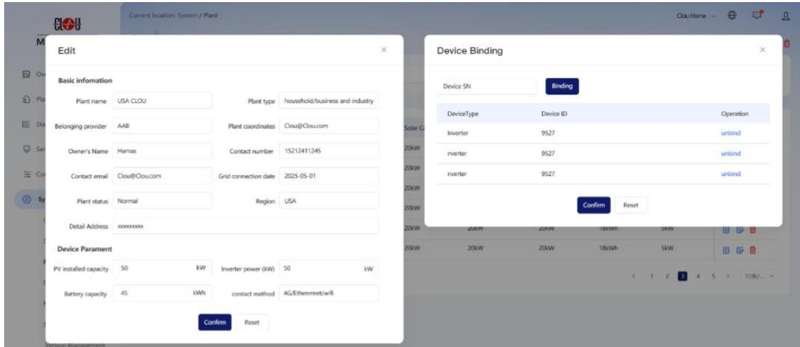

经销商在商储平台新建用户账号，并设定初始密码；

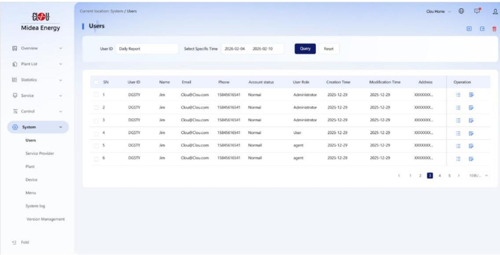

业主打开 APP 点击“登录”，首次登录，提示用户去重置密码；

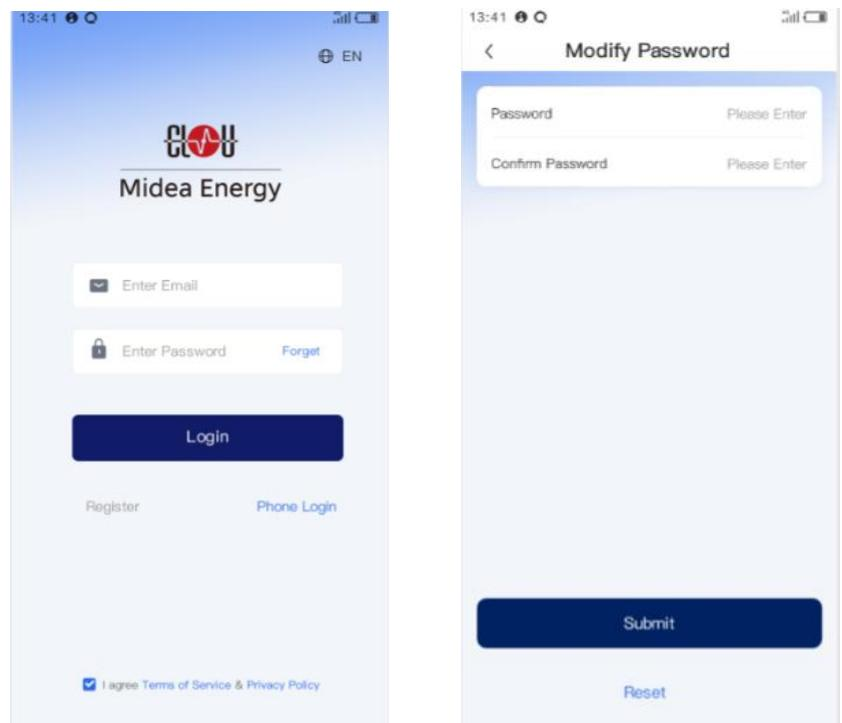

用户登录后，加载其场站设备信息。

# 2.服务商注册

打开 APP 点击“注册”，进入注册界面

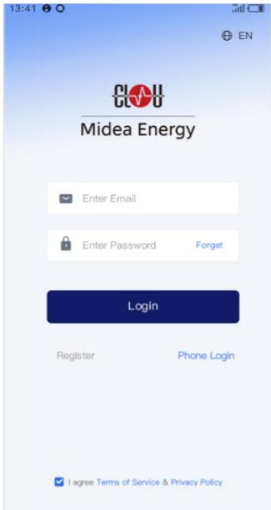

选择根据自身定位，选择”经销商“或“安装商”

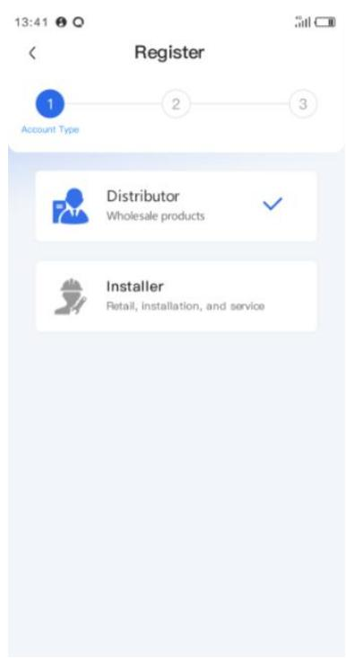

输入邮箱、营业证书、联系人、联系电话、公司名称、地址等信息（安装商需多提供电力施工资质，如电工证）

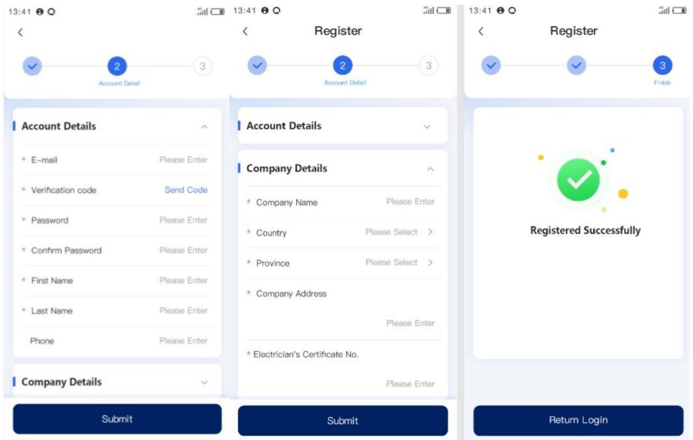

点击确认，注册成功。

# 3.创建场站（服务商）

登录 APP

打开 APP 点击场站按钮，点击场站列表右上角 $^ { \prime \prime } { } + ^ { \prime \prime }$ 按钮；

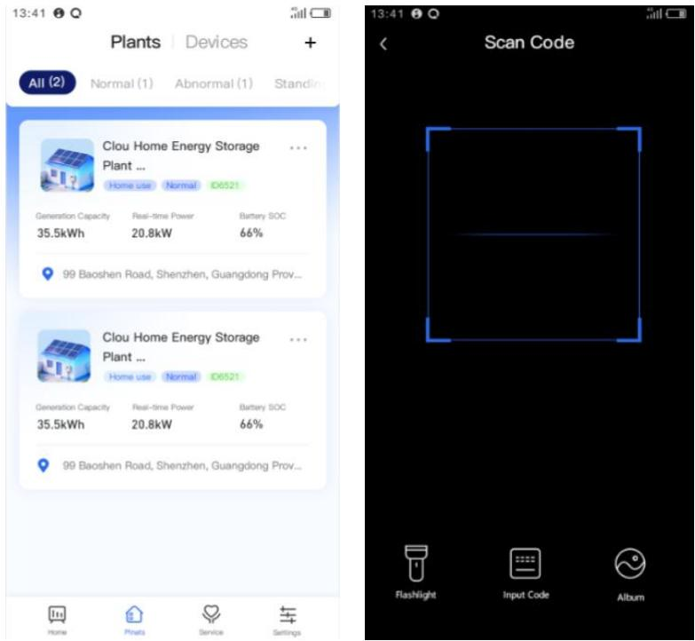

扫描随箱资料上的 SN码标签或逆变器的 SN 码；

输入场站业的信息及邮箱、地址等信息，点击“下一步”；

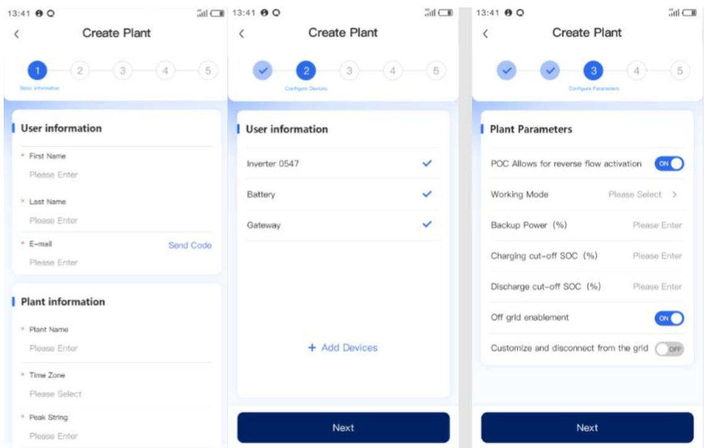

显示当前站点已添加的设备，点击”下一步”;（如有没有检测与添加的设备，可先跳过）；

输入场站的参数，是否防逆流、工作模式，备电 SOC，充放电上下限及自定义并离网的设置，点击“下一步”；

自检，检测云平台连接、网络状态及直流侧、通讯及储能的状态，通过点击“下一步”；

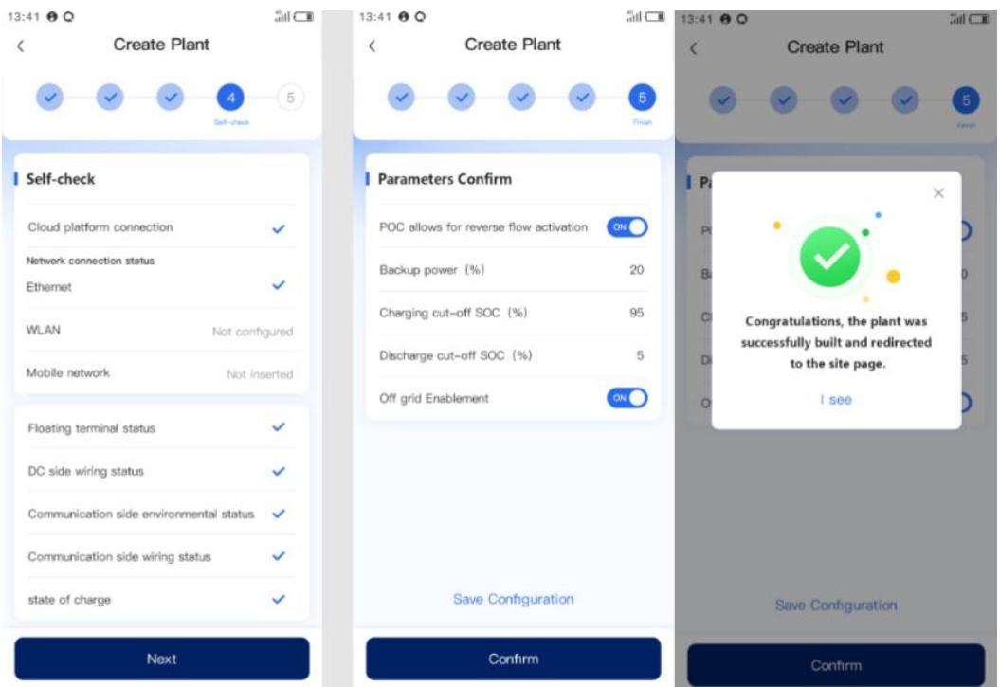

确认设定的参数，建站成功。

# 4. 关机操作

#  设置（Setting) 场站设置（Plant Setup) 开关机 （Power on/off)

确认提示：

确定关机？系统将停止运行。点 确认系统安全停机流程：

先降功率 断并网 / 离网输出停止 $\mathsf { P C S } $ 断开 DC 主继电器BMS 下电 系统进入待机（Standby）

 APP 显示：已关机（Off）、所有功率为 $\ r _ { 0 } $ 关机完成。

# 5. 开机操作

# 设置（Setting) 场站设置（Plant Setup) 开关机（Power on/off)

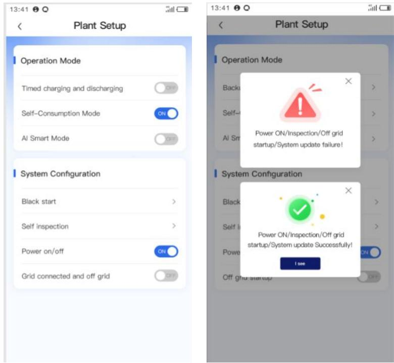

确认提示：

确定开机？系统将自检并启动。点 确认（Confirm）

 系统自动执行：

BMS/ 电池自检 DC 预充、母线升压 →PCS 启动、并网 / 待机

$\bullet$ 开机完成。

# 6. 充放电模式切换

在新建场站时已经选择一种运行模式（默认为自发自用模式）。

 设置（Setting) 场站设置（Plant Setup) 运行模式（Power on/off)

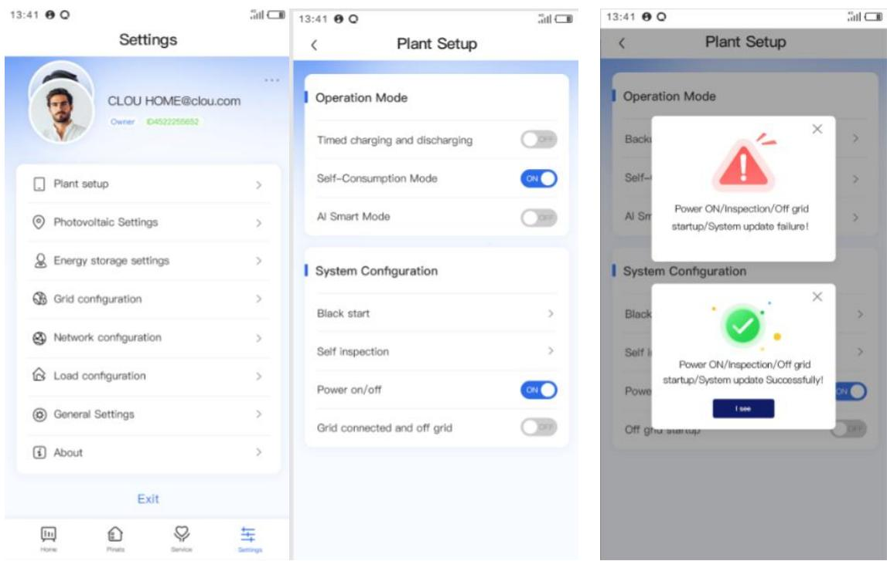

 点击相应 AI模式、自发自用、按时间充放电的模式后的开关可进行切换。

$\bullet$ 系统自动执行：

选择新的充放电模式后，云端校验后 设备停机/降载 状态自检 新策略加载 功率重启 反馈确认的完整流程

系统提供新充放电模式切换成功。

# 充放电模式设置

点击每个模式可对应设置每个模式的参数

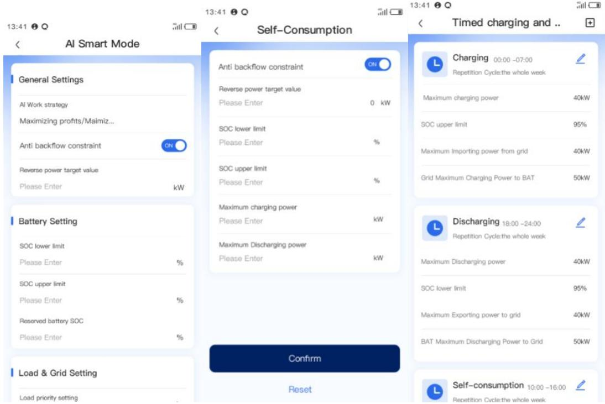

# 7.并离网-并转离（默认自动切换）

#  APP 前置检查

电池 $50 C \geq 5 0 \%$ （建议 $\ge 7 0 \%$ ）无故障告警、系统正常负载功率 $\leq$ 离网额定功率

 APP 操作

1. 进入设置（Setting) 场站设置（Plant Setup) 并离网（Grid connected andoff grid)

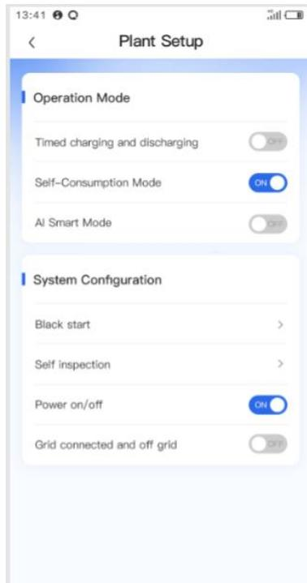

 点击 切换至离网 确认  
 输入安全密码（如需）  
$\bullet$ 系统执行（后台自动）  
 停止充放电 断开电网开关  
 PCS 进入离网 VF 模式（建立电压 / 频率）  
 黑启动成功 带载运行  
 APP 状态显示：离网运行  
$\bullet$ 离网后注意仅备电回路供电不可超功率、不可并网观察 SOC，低电量自动停机

# 8.并离网-离转并（默认自动切换）

$\bullet$ 检查条件  
 电网已恢复、电压 / 频率正常  
 无故障、电池电量充足  
 负载不过载  
$\bullet$ APP 操作  
 进入设置（Setting) 场站设置（Plant Setup) 并离网（Grid connected andoff grid)

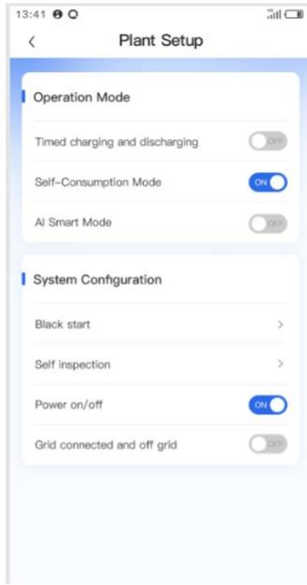

# 点击 切换至并网 确认

# $\bullet$ 系统执行（后台自动）

离网停机 检测电网  
锁相（电压 / 频率 / 相位同步）  
闭合并网开关 并网运行  
APP 状态：并网运行

# 9.系统自检

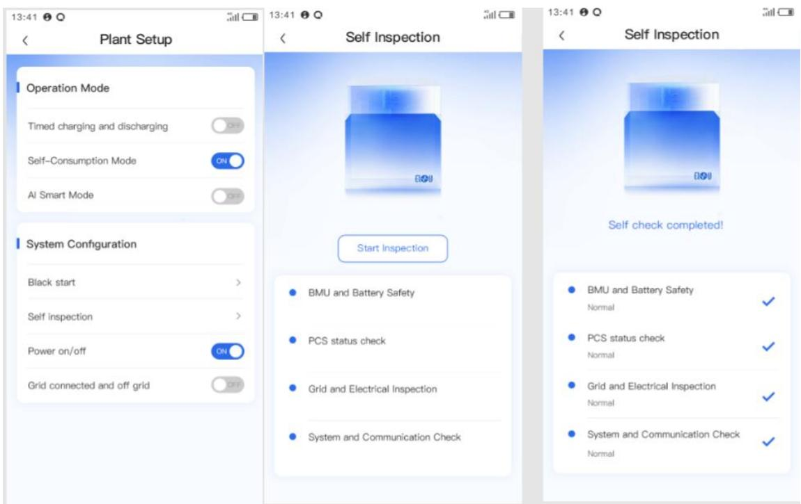

自检结果：通过 / 异常

检测项：电池系统（BMS）检测、逆变器（PCS）检测、电网与电气安全检测、系统与通信检测

自检完成后返回各模块状态结果，失败则提示用户重新自检或反馈给经销商。

 APP 操作

进入设置（Setting) 场站设置（Plant Setup) 自检（Self Inspection)

跳转到自检界面，点击 开始自检

自检针对各模块进行检测，成功则显示正常，不成功显示异常，并提示用户重新检查或联系经销商。

# 10.工单

工单来源由两部分组成，服务商新建、反馈转换

打开商储云平台，点击菜单服务>工单，点击右上角新增图标

新增工单窗口，输入工单、场站设备、派往场站联系人信息及电话、安装维修人员，点击确认。

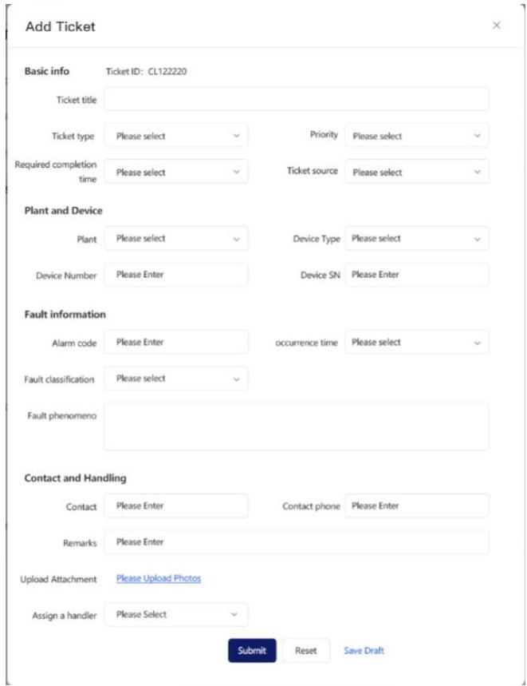

生成一条工单信息，并发送站内信或 APP 推送给到安装维修人员。

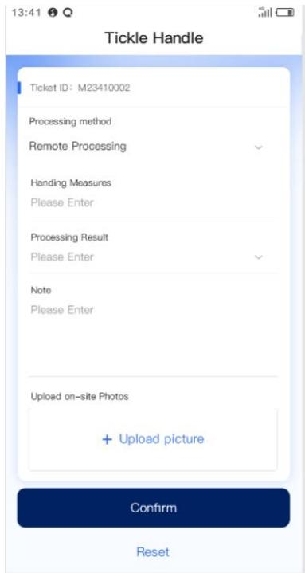

工单处理完成后，维修工程师通过 APP 上传工单处理情况及现场照片等信息。

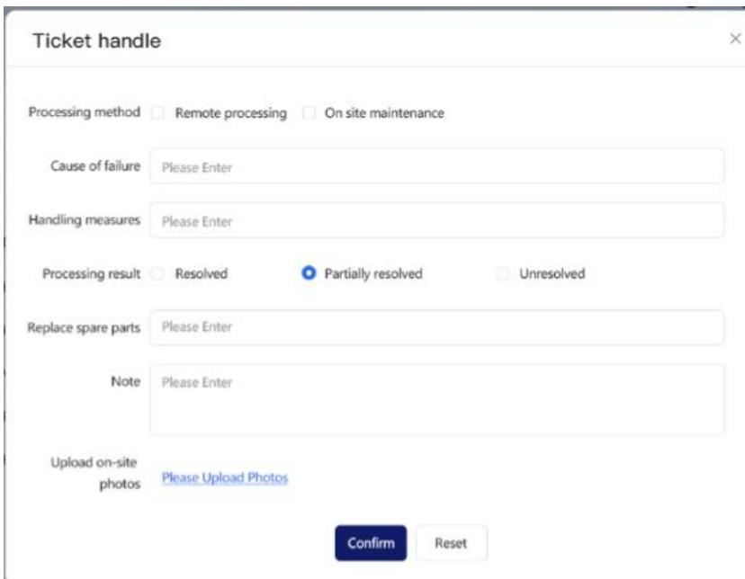

服务商登录商储平台验收工单情况并关闭工单。

# 11.反馈

登录 APP

点击服务>帮助中心，点击右下角

的反馈按钮，弹出反馈页面

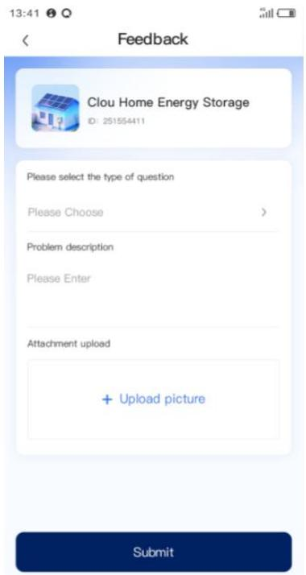

用户输入反馈问题的类型，是产品咨询还是产品问题，问题描述图片等上传，反馈列表生成一条反馈记录。

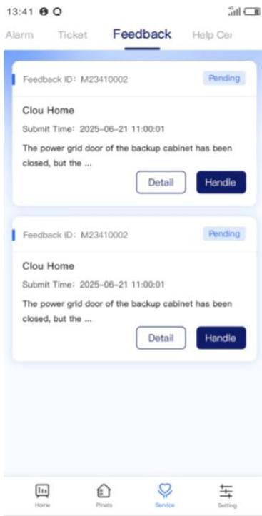

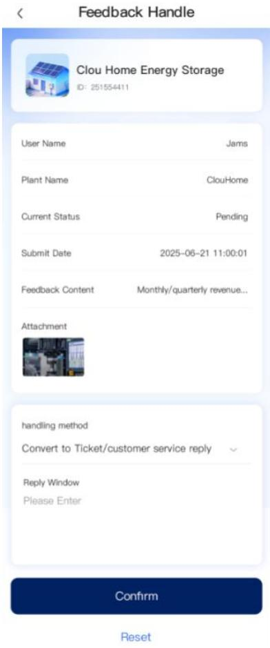

服务商在反馈列表中查看反馈信息，产品咨询给出解答，产品问题则转成工单信息。